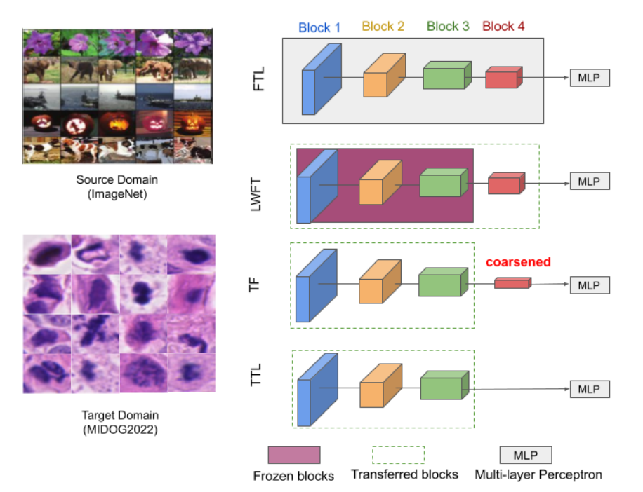

# [Rethink Transfer Learning in Medical Image Classification](https://arxiv.org/abs/2106.05152)
This is the PyTorch implemention of our paper **[Rethink Transfer Learning in Medical Image Classification](https://arxiv.org/abs/2106.05152)** [In preparation for IEEE Transactions on Medical Imaging, 2022]


Overview            |  results
:-------------------------:|:-------------------------:
 |  


# Usage
## Setup
### **pip**

See the `requirements.txt` for environment configuration. 
```bash
pip install -r requirements.txt
```

## Dataset
<figure></figure>
### **BIMCV**
- Please download our pre-processed datasets [TBA](), put under `data/` directory and perform following commands:
    ```bash
    cd ./data
    unzip digit_dataset.zip
    ```

### **HAM10000**
- Please download the dataset [here](https://dataverse.harvard.edu/dataset.xhtml?persistentId=doi:10.7910/DVN/DBW86T), put under `data/HAM10000/` 

### **PENet Dataset**
- Please download the dataset [here](https://github.com/marshuang80/penet), put under `data/PENet/` directory and perform following commands:


## Train
### 2D experiment (BIMCV & HAM1000)
**block-wise TTL**

Please using following commands to train a model with federated learning strategy.
- **--model** specify model archicture: resnet50 | densenet201
- **--pretrained** specify source domain: imagenet | chexpert
- **--dataset** specify target dataset: BIMCV | HAM10000
- **--trunc** specify truncation point: {-1, 1, 2, 3}

```bash
python main.py --model resnet50 --bs 64 --data_parallel --num_workers 12 --max_epoch 200 --pretrained imagenet --dataset BIMCV --trunc -1 --exp 1 --sub 100
```


**layer-wise TTL**

**--trunc** specify truncation point: {-1, 1, 2, ..., 16}

```bash
python main.py --model layerttl_resnet50 --bs 64 --data_parallel --num_workers 12 --max_epoch 200 --pretrained imagenet --dataset BIMCV --trunc -1 --exp 1 --sub 100
```

### Test
**block-wise TTL**

```bash
python main.py --model resnet50 --bs 64 --data_parallel --num_workers 12 --max_epoch 200 --pretrained imagenet --dataset BIMCV --trunc -1 --exp 1 --sub 100
```

**layer-wise TTL**

```bash
python main.py --model layerttl_resnet50 --bs 64 --data_parallel --num_workers 12 --max_epoch 200 --pretrained imagenet --dataset BIMCV --trunc -1 --exp 1 --sub 100
```


If you use this code or dataset in you research, please consider citing our paper with the following Bibtex code:

```
@article{peng2021rethink,
  title={Rethink Transfer Learning in Medical Image Classification},
  author={Peng, Le and Liang, Hengyue and Li, Taihui and Sun, Ju},
  journal={arXiv preprint arXiv:2106.05152},
  year={2021}
}
```
