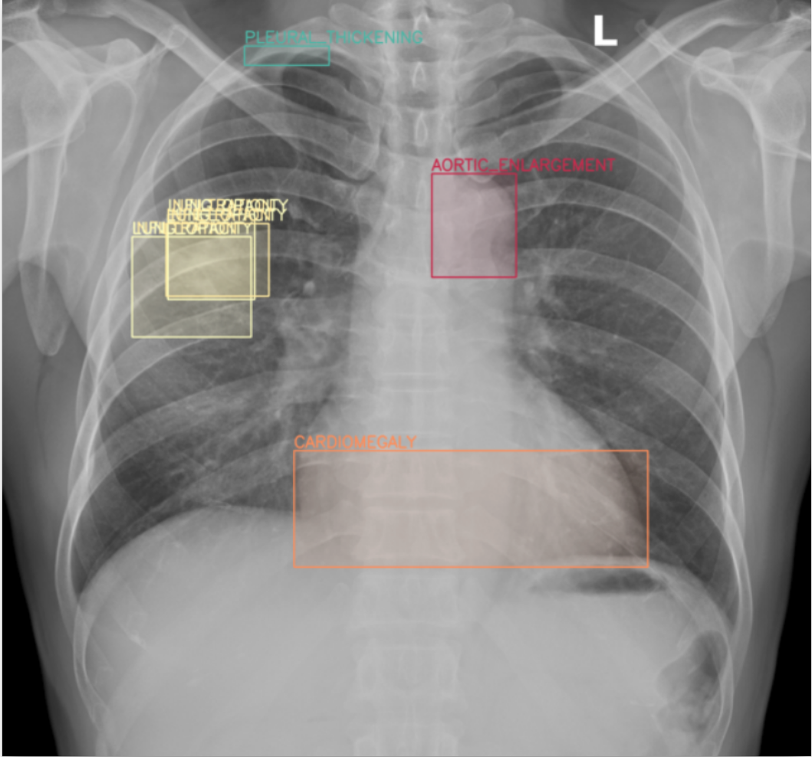
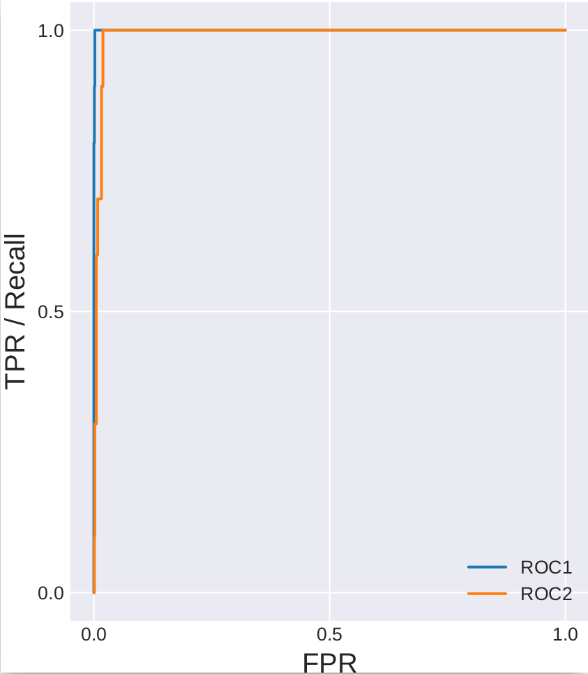
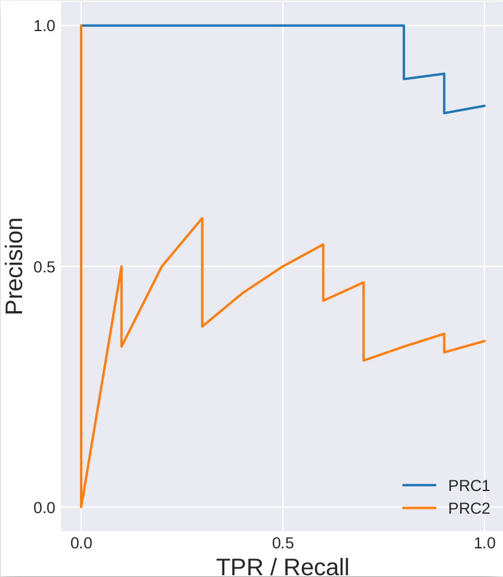
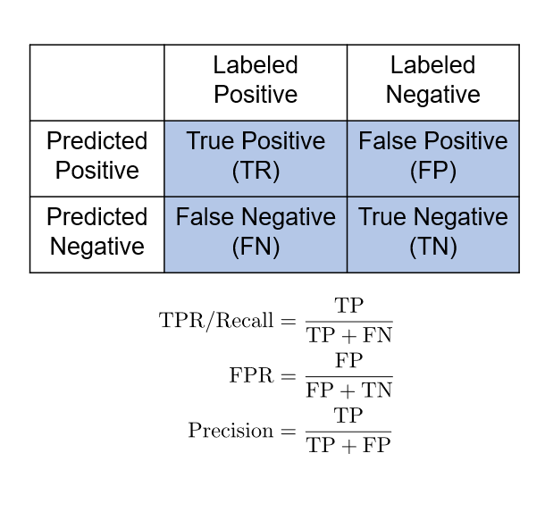
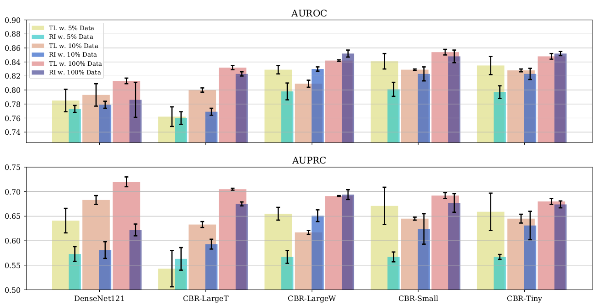
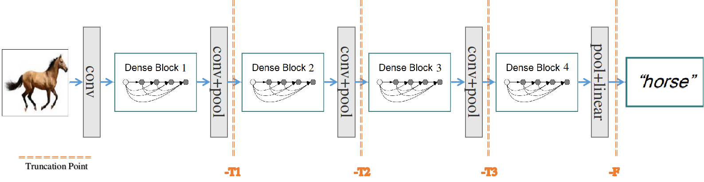
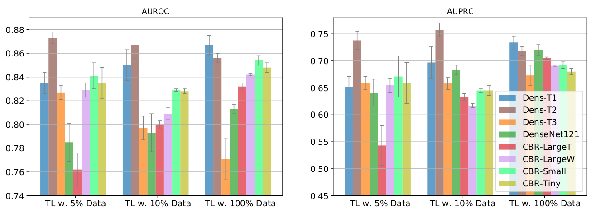
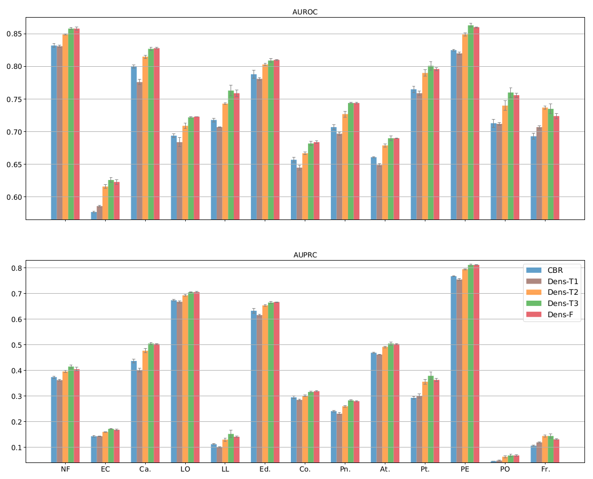

# [Rethink Transfer Learning in Medical Image Classification](https://arxiv.org/abs/2106.05152)

 
Le Peng1, Hengyue Liang2, Taihui Li1, Ju Sun1

 
1 Computer Science and Engineering, University of Minnesota

 
2 Electrical and Computer Engineering, University of Minnesota

 
**[Transfer learning](https://en.wikipedia.org/wiki/Transfer_learning)** (TL) with deep convolutional neural networks (DCNNs) has proved successful in many medical image classification (MIC) tasks. In the conventional TL practice, the following two steps are taken :

   1. **Pretraining**: A DCNN is first trained on a general-purpose, large-scale benchmark computer vision dataset (e.g., [ImageNet](https://www.image-net.org/)).

   2. **Fine-tuning**: The pretrained DCNN is then trained on the target dataset of interest (e.g., chest x-ray images to identify diseases).

It is generally believed that the pretraining step helps the DCNN to learn general features of the natural images, which can be reused to the target task. As a result, TL can not only speed up the training, but also improve the performace when the target task can only provided very limited number of training data.

However, the above mentioned **TL practive is puzzling, in the sense that MIC typically relies on ONLY low- and/or mid-level features** that are learned in the **bottom layers of DCNNs**. For example, in a chest x-ray image shown below, doctors relies on low-/mid-level visual features (such as blobs, oppacities) to diagnose pathologies, while high-level features (e.g., to tell that this is a human chest) is irrelevant to our diagnostic task.

<figure></figure>

<figcaption>Figure 1: An example chest X-ray with observable pathologies. Area marked in colored box are pathologies annotated by experienced pathologists.</figcaption>

Follow this intuition, it is naturally questionable if the current TL practice is the best possible in MIC domain, since we **may not need to reuse the high-level pretrained features**. In our paper **'[Rethink Transfer Learning in Medical Image Classification](https://arxiv.org/abs/2106.05152)'**, we perform careful experimental comparisons on shallow and deep networks, with different TL strategies, to answer this question. Indeed, we find that:

   1. Deep models are not always favorable, but TL most often benefits the model performance, no matter the network is shallow or deep. This conclusion challenges part of the conclusion made in a prior work: [Transfusion:Understanding Transfer Learning for Medical Imaging](https://ai.googleblog.com/2019/12/understanding-transfer-learning-for.html).

   2. Fine-tuning truncated version of DCNNs almost always yields the best performance in the target MIC task. This, if confirmed further in other medical imaging tasks such as segmentation, can be a new pattern to practice TL in medical image domain.

   3. Point 2 is especially significant in the data-poor regime.

In what follows, we briefly introduce our findings.

### Both ROC and PRC should be used to evaluate classifier performance in MIC

**In MIC tasks, it is common for the dataset to be highly imbalanced**. (For example, one can expect that most medical scans attempting to diagnose a rare disease will return negative result.) In machine learning community, it is well know that precision-recall-curve **(PRC) is more informative and indicative** of the true performance than the receiver-operating-characteristic **(ROC)** curve **under dominant negative classes**. 

Here is a simple examplt to illustate the difference between **ROC** and **PRC** curves:

`  Let's consider a dataset consisting of 10 positives and 990 negatives for a rare disease. Assume classifier A     (CA) scores the positives uniformly random distributed over its top 12 predictions; and classifier B (CB) scores   the positives uniformly random distributed over its top 30 predictions. Intuitively, CA is a much better           classifer as they detect 1 true-positive (TP) at the cost of 0.2 false-positive (FP), comparing with 1 TP:2 FP     for CB --- this information is captured by **Precision**, but not recall.`

<figure></figure>

<figcaption>Figure 2: ROC (left) and PRC (middle) of CA and CB for the example classification task. The ROC curves for both classifiers are high and close, almost showing no significant performance gap; while the PRC curve seperate two classifiers apart, reflecting the precision gap of the two classifiers. The confusion table (Right) recaps the definition of ROC, PRC and relevant terminologies.</figcaption>

`  Figure 2 depicts the performance of CA and CB using ROC and PRC metric respectively. As PRC takes into account     the precision, it is able to separate CA and CB by a large margin and give a clear indication which is the         better classifier under the example imbalanced classification problem. Indeed, one of the main reasons that our   paper draws conclusions that challenge the previous work [Transfusion]                     (https://ai.googleblog.com/2019/12/understanding-transfer-learning-for.html) is that they only evaluate their       models with ROC curve, whereas we evalute our models with both ROC and PRC curves.`

### Transfer Learning (TL) v.s. Random Initialization (RI)

  We compare TL and RI on deep networks (DenseNet121, ResNet50, as both are popular choices in Medical Imaging Classification tasks) and shallow networks (CBR families as introduced in [Transfusion](https://ai.googleblog.com/2019/12/understanding-transfer-learning-for.html)). We choose the public dataset [CheXpert](https://stanfordmlgroup.github.io/competitions/chexpert/) as the data-rich regime, since the whole dataset consists of 224,316 chest radiographs, much more than typical medical datasets that are maintained in local hospitals/institutions; we simulate the data-poor regime with our [local COVID dataset obtained from M Health Fairview, Minnesota](https://www.medrxiv.org/content/10.1101/2021.06.04.21258316v1) (the smallest subset consists of only 88 positives and 1451 negatives), whose size is more commonly seen in real-life practice.

We find from our experiment that:

  1. Data-rich regime (CheXpert): Overall, TL and RI perform comparably on most pathologies and models, but TL outperforms RI by significant gaps in a number of cases (e.g., ResNet50 on Pt., TL is 10% above RI as measured by AUPRC in Figure 3). Contrary to the conclusion drawn in [Transfusion](https://ai.googleblog.com/2019/12/understanding-transfer-learning-for.html) `transfer learning does not significantly affect performance on medical imaging tasks, with models trained from scratch performing nearly as well as standard ImageNet transferred models`, our result in Figure 3 clearly shows that **DenseNet121 with TL** is the winner against all other models and **AUPRC is the crucial tie-breaker**.

<figure></figure>

<figcaption>Figure 3: TL v.s. RI on CheXpert for deep and shallow networks. For most cases RI performs on par with TL (especially for shallow networks), but in a number of cases TL outperforms RI by a gap, especially noticable when measured by AUPRC. </figcaption>

  2. Data-poor regime (Our COVID data): As is shown in Figure 4, TL as expected benefits the deep model (DenseNet121) most. For the shallow models, the benefit of TL is not so definite. Although in many cases shallow models with TL performs better than RI, there are also a few cases (e.g., CBR-LargeW with 10% data) RI wins over TL. It is also worth mentioning that in Figure 5, the best performing AUROC model and AUPRC model are not consistent. This disparity again highlights the need for reporting both metrics in MIC tasks.

<figure></figure>

<figcaption>Figure 4: TL v.s. RI on COVID. TL wins over RI on DenseNet121 for all subsampled set of data, and the performances of DensNet121 are close to those of shallow models. With 10% and 5% subsampled data only, TL outperforms RI on all but CBR-LargeT and CBR-LargeW</figcaption>

### Truncated Transfer Learning

As discussed earlier in this post that `MIC typically relies on ONLY low- and/or mid-level features`, it is natural to ask if we can have better ways of performing TL since we may not need high-level features. This motivates us to propose applying TL over truncated networks, which corresponds to different level of feature reusing, as is shown in Figure 5.

<figure></figure>

<figcaption>Figure 5: The illustration of different truncation level of the DenseNet121. T1 - T4 correspond to truncation that target at low - high level feature reuse. </figcaption>

Figure 6 summarizes the result on our COVID dataset and Figure 7 on CheXpert. Based on these experiments, we can conclude:

  1. The heavily truncated network (Dens-T1, Dens-T2) are the top two performant models when combined with TL on the COVID dataset. From COVID-19 medical studies, it is known that salient radiomic features for COVID-19 are opacities and consolidation in the lung area that only concern low-level textures. Thus this result is a strong confirmation that only a reasonable number of bottom layers are needed for efficient TL in this task.
  2. The mid-level truncation Dens-T3 is overall the best model on the CheXpert dataset, with Dens-F is almost comparable to Dens-T3 in most cases. This disparity can again be explained by feature hierarchy. In CheXpert, pathologies such as atelectasis and pneumothorax need relatively high-level features as they start to concern shapes, in contrast to the low-level texture features used in COVID-19.
  3. Another observation from Figure 8 is that on EC, LL, PO, Fr., the AUPRCs are very low (below 20%) although the corresponding AUROCs are all above 60% or even mostly 70%. These are rare diseases in CheXpert with high imbalance ratios `(positive : negative is at best less than 1:15)`. Even for the best models here, the AUROCs may be considered decent, but their actual performance, when precision is taken into account via AUPRC, is very poor.
This reinforces our claim that AUPRC needs to be reported when evaluating classifiers on data with class imbalance.

<figure></figure>

<figcaption>Figure 6: TL AUROC and AUPRC on COVID dataset. We include all shallow networks and different truncated version of DenseNet121. Dens-T1 and Dens-T2 are among the best performing models. </figcaption>

<figure></figure>

<figcaption>Figure 7: TL AUROC and AUPRC on CheXpert dataset. Here we demonstrate CBR-Small as CBR, which performs the best among all shallow models. Overall, Dens-T3 performs the best considering all pathologies but Dens-F is also close to Dens-T3.</figcaption>

### Conclusions and Future Work

In this work we revisited trasfer learning (TL) in medical imageing classification (MIC) on chest x-rays. By evaluating different TL strategies on a number of shallow and deep convolutional networks, we find that:

  1. TL does benefit the classification performance, especially in data-poor scenarios.
  2. Only transferring truncated deep pretrained models up to layers commensurate with the level of features needed for the classification task leads to superior performance compared to conventional TL on deep and shallow
models.
  3. Our work also highlighted the role of AUPRC in distinguishing good classifiers from mediocre ones under class imbalanced dataset.

Our results support that low- and mid-level visual features are probably sufficient for typical MIC. Therefore, it would be interesting in the future to:

  1. perform evaluation on other image modalities, such as CT and MRI images. If similar conclusion holds, the truncated TL strategy can lead to a profound saving of computing resources while keeping good performance for model training and inference on 3D medical data.
  2. validate the conclusion on segmentation, another major family of imaging tasks, and other diseases.
  3. investigate TL from models directly trained on medical datasets (e.g., Nvidia Clara Imaging) instead of natural images for computer vision tasks (e.g., ImageNet).

### Acknowledgements

The authors acknowledge the Minnesota Supercomputing
Institute (MSI) at the University of Minnesota, and Microsoft Azure for providing
computing resources.

 
`First posted by Hegyue Liang, Wednesday, June 9, 2021.`

 
